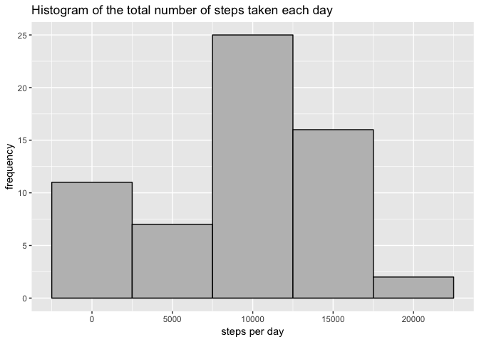
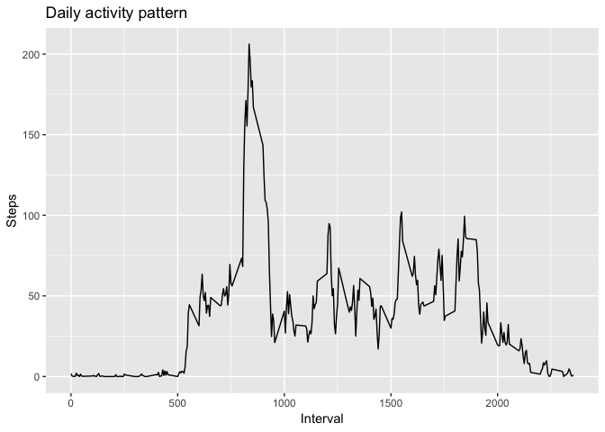
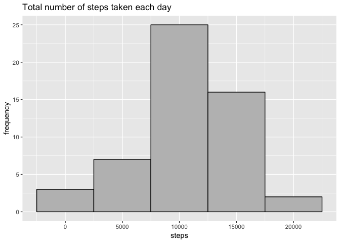
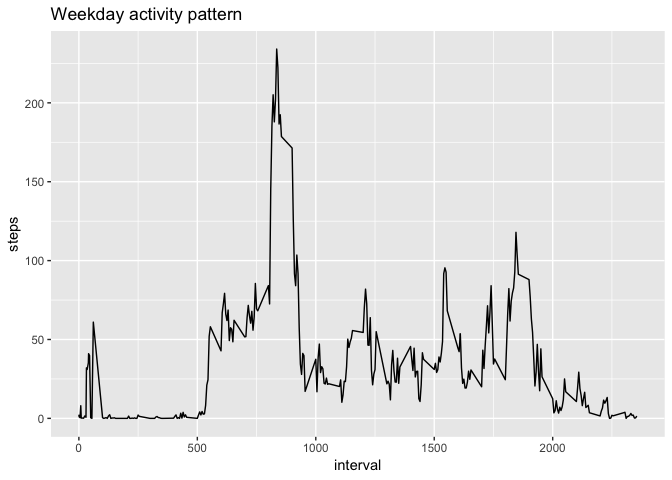
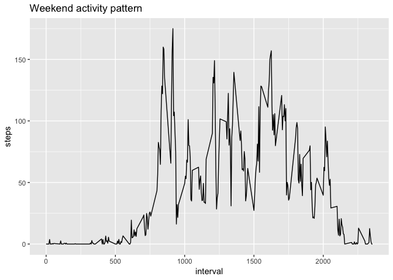

##Reproducible Research Assignment 1
load the packages will be used

```r
library(ggplot2)
library(knitr)
library(dplyr)
```

```
## 
## Attaching package: 'dplyr'
```

```
## The following objects are masked from 'package:stats':
## 
##     filter, lag
```

```
## The following objects are masked from 'package:base':
## 
##     intersect, setdiff, setequal, union
```

load the data and take a look at the dataset

```r
data <- read.csv("~/Downloads/activity.csv")
str(data)
```

```
## 'data.frame':	17568 obs. of  3 variables:
##  $ steps   : int  NA NA NA NA NA NA NA NA NA NA ...
##  $ date    : Factor w/ 61 levels "2012-10-01","2012-10-02",..: 1 1 1 1 1 1 1 1 1 1 ...
##  $ interval: int  0 5 10 15 20 25 30 35 40 45 ...
```

##What is mean total number of steps taken per day?
1. Calculate the total number of steps taken per day

```r
step <- tapply(data$steps, data$date, FUN = sum, na.rm = TRUE)
step1 <- data.frame(as.numeric(step))
```

2. Plot the histogram

```r
ggplot(data = step1, aes(step1$as.numeric.step.))+
    geom_histogram(color = "black", fill = "grey", binwidth = 5000)+
    xlab("steps per day")+ylab("frequency")+
    ggtitle("Histogram of the total number of steps taken each day")
```

<!-- -->

3. Calculate and report the mean and median

```r
print(step_mean <- mean(step1$as.numeric.step.))
```

```
## [1] 9354.23
```

```r
print(step_media <- median(step1$as.numeric.step.))
```

```
## [1] 10395
```

##What is the average daily activity pattern?
Calculate the average steps across all days

```r
step2 <- tapply(data$steps, data$interval, FUN = mean, na.rm = TRUE)
step2 <- data.frame(step2)
step2 <- step2[ ,c("step2")]
intervals<-unique(data$interval)
step_interval <-data.frame(cbind(step2,intervals))
```

1.Plot the daily activity pattern

```r
ggplot(data = step_interval, aes(x = step_interval$intervals, y = step_interval$step2))+
    geom_line()+xlab("Interval") + ylab("Steps") + ggtitle("Daily activity pattern")
```

<!-- -->

2. Find out the the interval contains the maximum number of steps

```r
which.max(step_interval$step2)
```

```
## [1] 104
```


##Inputting missing values
1. Calculate the total number of missing values

```r
sum(is.na(data$steps))
```

```
## [1] 2304
```

2. We will use the mean of the 5-minute interval to fill the missing values. First, let's make a function that will return the mean value for a particular interval.

```r
getMeanStepsPerInterval<-function(interval){
    step_interval[step_interval$intervals==interval,]$steps
}
```

3. Now, create a new dataset with the missing values filled with the mean of interval by using for loop. Let's call the new dataset "datafilled".

```r
datafilled <- data
for(i in 1:nrow(datafilled)){
    if(is.na(datafilled[i,]$steps)){
        datafilled[i,]$steps <- getMeanStepsPerInterval(datafilled[i,]$interval)
    }
}
```


```r
sum(is.na(datafilled$steps))
```

```
## [1] 0
```

4. Make a histogram of the total number of steps taken each day

```r
totalstepday <- aggregate(steps ~ date, data=datafilled, sum)
ggplot(data = totalstepday, aes(totalstepday$steps))+
    geom_histogram(color = "black", fill = "grey", binwidth = 5000)+
    xlab("steps") +ylab("frequency") +ggtitle("Total number of steps taken each day")
```

<!-- -->

Report the mean and median total number of steps taken per day

```r
print(mean(totalstepday$steps))
```

```
## [1] 10766.19
```

```r
print(median(totalstepday$steps))
```

```
## [1] 10765
```


##Are there differences in activity patterns between weekdays and weekends?
1. Create a new factor variable in the dataset with two levels – “weekday” and “weekend”

```r
class(datafilled$date)
```

```
## [1] "factor"
```

```r
datafilled$date <- as.Date(strptime(datafilled$date, format="%Y-%m-%d"))
class(datafilled$date)
```

```
## [1] "Date"
```

Add a weekday column into the dataset

```r
datafilled$day <- weekdays(datafilled$date)
str(datafilled)
```

```
## 'data.frame':	17568 obs. of  4 variables:
##  $ steps   : int  1 1 1 1 1 1 1 1 1 1 ...
##  $ date    : Date, format: NA NA ...
##  $ interval: int  1 1 1 1 1 1 1 1 1 1 ...
##  $ day     : chr  NA NA NA NA ...
```

Classify weekday/weekend

```r
for (i in 1:nrow(datafilled)) {
    if (datafilled[i,]$day %in% c("Saturday","Sunday")) {
        datafilled[i,]$day<-"weekend"
    }
    else{
        datafilled[i,]$day<-"weekday"
    }
}
```


Seperate the dataset into weekdays/weekends dataset

```r
weekday <- filter(datafilled, datafilled$day == "weekday")
weekdaystep <- aggregate(weekday$steps ~ weekday$interval + weekday$day, weekday, mean)
names(weekdaystep) <- c("interval", "day", "step")

weekend <- filter(datafilled, datafilled$day == "weekend")
weekendstep <- aggregate(weekend$steps ~ weekend$interval + weekend$day, weekend, mean)
names(weekendstep) <- c("interval", "day", "step")
```


2. Plot the activity pattern by weekdays/weekends

```r
ggplot(data = weekdaystep, aes(x = weekdaystep$interval, y = weekdaystep$step)) + 
    geom_line() + xlab("interval") + ylab("steps") + ggtitle("Weekday activity pattern")
```

<!-- -->

```r
ggplot(data = weekendstep, aes(x = weekendstep$interval, y = weekendstep$step)) + 
    geom_line() + xlab("interval") + ylab("steps") + ggtitle("Weekend activity pattern")
```

<!-- -->


The activity pattern of weekdays and weekends are different. 
During weekdays, steps are taken more often before noon, while during weekends, steps are activly taken from the late morning to afternoon.
